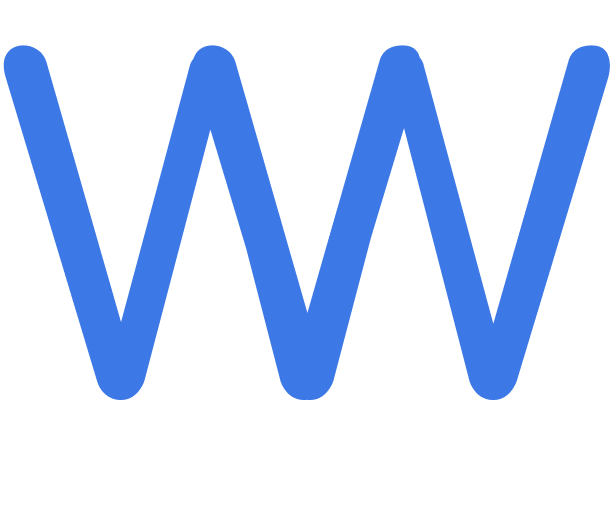

## WorkWhile - Find Your Perfect Job

    

### About WorkWhile

WorkWhile is an innovative job seeking platform designed to connect talented professionals with their ideal employment opportunities. Our streamlined interface and powerful matching algorithms ensure that job seekers find positions that align with their skills, values, and career goals.

### Key Features

- 🔍 **Smart Search** - Find relevant job opportunities based on your skills and preferences
- 💼 **Profile Builder** - Create a compelling professional profile to attract employers
- 📊 **Application Tracking** - Monitor your application status in real-time
- 📱 **Mobile Responsive** - Access WorkWhile on any device, anywhere
- 🔔 **Instant Notifications** - Stay updated on new opportunities and application progress

### Getting Started

1. Clone this repository
2. Install dependencies with `npm install`
3. Start the development server with `npm run dev`
4. Visit `http://localhost:5173` in your browser

### Technology Stack

- React.js
- Vite

### Contributing

We welcome contributions to WorkWhile! Please see our contributing guidelines for more information.

    

### License

This project is licensed under the [MIT License](LICENSE).